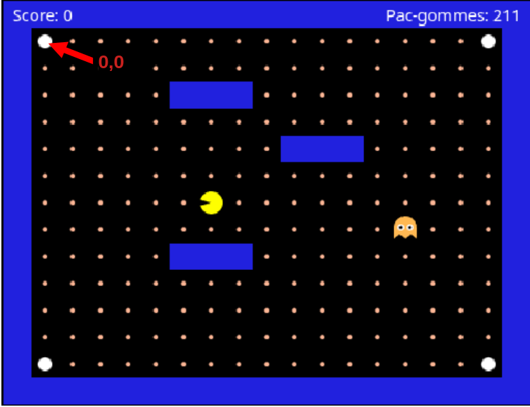
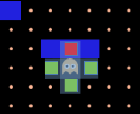
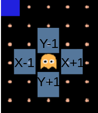
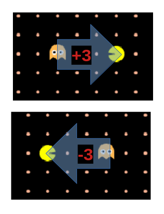

# Atelier 1 (Starter) - Arbre de décision

**Bienvenue !** Tu vas programmer l'intelligence du fantôme de Pac-Man.

**Objectif :** récupérer dans `buildInfos` les informations essentielles à la programmation du fantôme, puis écrire dans `chooseDirection` les règles qu'il doit suivre, à l'aide d'un arbre de décision.

## Glossaire

| Terme | Signification |
| --- | --- |
| `buildInfos` | Fonction où tu construis la table infos (les réponses pour le fantôme) |
| `chooseDirection` | Fonction où tu écris les règles « si... alors... » pour choisir une direction |
| `ghost.gridX / gridY` | Position du fantôme en cases sur la carte |
| `pacman.gridX / gridY` | Position de Pac-Man en cases |
| `map.isWall(x, y)` | true si la case (x, y) est un mur |
| `if / then / end` | `if condition then return 'left' end` — si la condition est vraie, choisis cette direction |
| `and` / `or` / `not` | Opérateurs logiques (remplacent `&&`, `\|\|`, `!`) |
| `'left' / 'right' / 'up' / 'down'` | Les 4 directions possibles (toujours entre apostrophes) |
| `canGoLeft` | Tu le calcules : `not map.isWall(ghost.gridX - 1, ghost.gridY)` |
| `distanceX` | Tu le calcules : `pacman.gridX - ghost.gridX` |
| `totalDistance` | Tu le calcules : `math.abs(distanceX) + math.abs(distanceY)` — nombre de cases entre fantôme et Pac-Man |
| `return nil` | « Je ne bouge pas » — à mettre à la fin si aucune règle ne s'applique |

---

## Aide

**Clavier :** clique l'**éditeur** pour coder (flèches = curseur). Clique le **jeu** pour jouer (flèches = Pac-Man). Le contour **jaune** indique le panneau actif.

Le code est sauvegardé automatiquement dans ton navigateur. Les erreurs s'affichent sous l'éditeur.

## Étape 1 - Bien démarrer

### Concept
Cet atelier se passe **entièrement dans le navigateur**.
Il y a trois panneaux côte à côte : **Instructions** (étapes et explications), **Code** (éditeur - tu modifies ton programme), **Jeu** (Pac-Man - tu testes ton code).

Dans l'éditeur, un seul fichier Lua avec **3 fonctions** :

- `buildInfos` - tu construis les données (Atelier 1)
- `chooseDirection` - tu écris les règles de direction (Atelier 1)
- `updateState` - pour l'Atelier 2 (ne touche pas pour l'instant)

Écrit bien ton code à **l'intérieur** de ces **3 fonctions** (entre `function` et `end`).

### Panneau Code
Modifie l'IA du fantôme dans le panneau **Code**, puis clique **Démarrer** pour charger et tester ton programme.

### Panneau Jeu
Clique le panneau **Jeu**, puis **Démarrer**, et utilise les **flèches** du clavier pour diriger Pac-Man.

### Utilisation du clavier

Lorsque tu cliques dans **l'éditeur** ou dans la **zone de jeu**, une bordure <span style="color: #fc0">jaune</span> indique le panneau actif : les touches de ton clavier seront envoyées uniquement au panneau actif.

### Méthodologie (à chaque étape)

1. Lis l'étape courante (ne saute pas d'étapes)
2. Modifie le code dans le panneau **Code**
3. Clique le panneau **Jeu**, puis **Démarrer** (ton code est chargé automatiquement)
4. Joue avec les **flèches** du clavier

### À toi de jouer
Pour cette étape, pas de code à écrire. Lis cette étape en entier et passe à l'étape suivante.

### Comment tester
Clique le panneau **Jeu**, puis **Démarrer**, puis les flèches. Pac-Man bouge, le fantôme reste immobile : **c'est normal**, tu n'as pas encore codé de règle pour ton IA de fantôme.


---

## Étape 2 - Les coordonnées sur la grille

### Concept
La zone de jeu est une **grille de cases**. Chaque case a une coordonnée `(gridX, gridY)` :

- `gridX` = numéro de **colonne** - 0 tout à gauche, augmente vers la **droite**
- `gridY` = numéro de **ligne** - 0 tout en haut, augmente vers le **bas**
- La case en haut à gauche est `(0, 0)`



Dans ton code, le jeu te donne déjà ces valeurs :

- `ghost.gridX` / `ghost.gridY` - position du fantôme
- `pacman.gridX` / `pacman.gridY` - position de Pac-Man
- `map.isWall(x, y)` - `true` si la case `(x, y)` est un mur (case bleu), `false` sinon

### À toi de jouer
Pas de code à écrire - lis bien cette étape. Quand c'est clair, passe à l'étape suivante.


### Vérifie
Tu sais lire `ghost.gridX`, `pacman.gridY` et comprendre `map.isWall(x, y)`.

### Si tu es bloqué
Concentre-toi sur les axes : origine en haut à gauche, X vers la droite, Y vers le bas.

### Réflexion
Si le fantôme est en `(3, 2)` et Pac-Man en `(6, 2)`, qui est le plus à droite ? Quelle est la valeur de `pacman.gridX - ghost.gridX` ?

---

## Étape 3 - Calculer canGoLeft

### Concept

Pour savoir si le fantôme peut aller à gauche, regarde la case à gauche. Pas de mur, on peut y aller.






**Ligne par ligne :**

1. `canGoLeft = not map.isWall(ghost.gridX - 1, ghost.gridY)` — « la case à gauche du fantôme n'est pas un mur »
2. `not` inverse `true` en `false` et vice versa — `map.isWall(ghost.gridX - 1, ghost.gridY)` veut dire « la case à gauche du fantôme est un mur », `not map.isWall(ghost.gridX - 1, ghost.gridY)` veut dire l'inverse.


### À toi de jouer
Dans `buildInfos`, remplace `return {}` par :

```lua
return {
  canGoLeft = not map.isWall(ghost.gridX - 1, ghost.gridY),
}
```

Ne touche pas à la fonction `chooseDirection` pour le moment. Clique **Démarrer** pour charger ton code.

### Comment tester
Clique **Démarrer**. Aucun message rouge sous l'éditeur = succès.

### Vérifie
Le code s'applique sans erreur (pas de texte rouge sous l'éditeur).

### Si tu es bloqué
Erreur de syntaxe ? Vérifie les mots-clés `then` / `end`, les virgules et les parenthèses. Tu as bien cliqué **Démarrer** ?

### Réflexion
Que retourne `map.isWall(X, Y)` si la case `(X, Y)` est un mur ? `true` ou `false` ?
Le code suivant : `not map.isWall(ghost.gridX + 1, ghost.gridY)` veut dire « la case à droite du fantôme n'est pas un mur » ou « la case à gauche du fantôme est un mur » ?

---

## Étape 4 - Première règle de direction

### Concept
Tu as codé `canGoLeft` dans `buildInfos`. Le jeu passe ce résultat à `chooseDirection` dans `infos`.

### Où modifier
Fonction `chooseDirection`. Remplace `return nil` par le bloc ci-dessous.

```lua
if infos.canGoLeft then
  return 'left'
end
return nil
```

### Observe le jeu:

`if infos.canGoLeft then` — « est-ce que je peux aller à gauche ? »
`  return 'left'` — si oui, choisis la direction gauche
`end` — fin de la condition
`return nil` — sinon, ne bouge pas

Pac-Man avance tout seul vers la gauche au départ. Le fantôme suit sa propre règle indépendamment : il va à gauche s'il n'y a pas de mur à sa gauche.

### Vérifie
Que le fantôme bouge vers la gauche quand il le peut.

### Si tu es bloqué
Le fantôme ne bouge pas ? As-tu cliqué **Démarrer** ? As-tu cliqué sur le jeu avant d'utiliser les flèches ?

### Réflexion
Que se passe-t-il si tu oublies le `return nil` à la fin de `chooseDirection` ?

---

## Étape 5 - Calculer distanceX

### Concept
Tu veux maintenant savoir où est Pac-Man par rapport au fantôme sur l'axe horizontal :

```lua
  distanceX = pacman.gridX - ghost.gridX
```

- si `distanceX` est positif, Pac-Man est à droite du fantôme
- si `distanceX` est négatif, Pac-Man est à gauche du fantôme




### Où modifier
Modifie `buildInfos` (ajoute `distanceX` aux propriétés) **et** `chooseDirection` (modifie la règle de l'étape précédente).

### Observe le jeu
Avec l'étape précédente seule, le fantôme part à gauche même si Pac-Man est à droite.

### À toi de jouer
Complète `buildInfos` avec `distanceX`. Puis modifie `chooseDirection` :

Dans `buildInfos` :
```lua
return {
  canGoLeft = not map.isWall(ghost.gridX - 1, ghost.gridY),
  distanceX = pacman.gridX - ghost.gridX,
}
```

Dans `chooseDirection` :
```lua
if infos.canGoLeft and infos.distanceX < 0 then
  return 'left'
end
return nil
```

### Astuce
Tu peux changer la position initiale de Pac-Man ou du fantôme en les déplaçant avec ta souris.
Ici tu veux faire en sorte que Pac-Man commence à droite du fantôme.

### Comment tester
Déplace Pac-Man à droite du fantôme avec ta souris (lorsque le jeu est arrêté) ou avec les flèches de ton clavier (pendant que le jeu tourne) : le fantôme ne doit plus partir à gauche automatiquement, mais uniquement lorsque Pac-Man se trouve à sa gauche.

### Vérifie
Pac-Man à droite : le fantôme ne part plus toujours à gauche.

### Si tu es bloqué
Le fantôme part toujours à gauche ?
Vérifie la condition `infos.distanceX < 0` : `infos.distanceX` est inférieur à zéro.
Et non `infos.distanceX > 0` : `infos.distanceX` est supérieur à zéro.

### Réflexion
Que signifie `infos.canGoLeft and infos.distanceX < 0` ?
- Le fantôme peut aller à gauche ET qu'il se trouve au même moment à gauche de Pac-Man
- Le fantôme peut aller à gauche OU qu'il se trouve à gauche de Pac-Man

---

## Étape 6 - Compléter les directions

### À toi de jouer
Ajoute la propriété `canGoRight` dans `buildInfos` sur le même modèle que `canGoLeft` :

```lua
return {
  canGoLeft = not map.isWall(ghost.gridX - 1, ghost.gridY),
  canGoRight = -- Ton code,
}
```

Ajoute également une règle dans `chooseDirection`, avant le `return nil` final (ne supprime pas la règle de l'étape précédente).
Cette règle devra se traduire par « si le fantôme peut aller à droite et que Pac-Man se trouve à sa droite alors il va à droite »

### Observe le jeu
Le fantôme doit suivre les mouvements de Pac-Man sur l'axe horizontal.

### Si tu es bloqué
Le fantôme ne va pas à droite ? Observe bien le modèle que tu as déjà pour faire bouger le fantôme à gauche.

---

## Étape 7 - Branches haut / bas

### À toi de jouer

Même logique mais en verticale. Complète `buildInfos` avec trois nouvelles propriétés :
- `canGoUp`
- `canGoDown`
- `distanceY`

Complète `chooseDirection` avec deux nouvelles règles pour que le fantôme suive Pac-Man sur l'axe vertical.

### Si tu es bloqué
Sépare bien tes propriétés par des virgules :

```lua
return {
  canGoLeft = not map.isWall(ghost.gridX - 1, ghost.gridY),
  canGoRight = -- Ton code,
  canGoUp = -- Ton code,
  canGoDown = -- Ton code,
  distanceX = -- Ton code,
  distanceY = -- Ton code,
}
```

---

## Étape 8 - Priorité des règles

### Concept
En diagonale, le **premier `if` qui correspond** gagne. L'ordre du code compte.
Par exemple, si dans ton code tu vérifies en premier que le fantôme doit aller à gauche ou à droite et qu'ensuite tu vérifies s'il doit aller en haut ou en bas :
- Il ira au maximum à gauche (ou à droite) avant d'aller en haut (ou en bas).

### Observation:
Place Pac-Man en diagonale. Quelle direction choisit le fantôme en premier ?

### Astuce jeu
Pour placer Pac-Man en diagonale, tu peux utiliser ta souris lorsque le jeu est arrêté, ou les flèches de ton clavier lorsque le jeu tourne.

### À toi de jouer
Dans `chooseDirection` uniquement : inverse l'ordre de deux règles (par ex. échange horizontal et vertical).
Observe la différence.

### Vérifie
Que changer l'ordre des règles change le comportement en diagonale.

### Réflexion
Quel est le problème avec ce comportement ?
Le fantôme est-il vraiment intelligent ?

---

## Étape 9 - Optimiser la recherche

### Concept
La différence entre un bon chasseur et un mauvais chasseur :
« Le bon chasseur ne teste pas les directions au hasard (ou pire, dans un ordre fixé) : il va d'abord vers l'axe où Pac-Man est **le plus loin**. »


La distance horizontale et verticale sont déjà presque présentes dans le code avec `distanceX` et `distanceY`.
Cependant pour l'instant tu n'as utilisé que le signe de ces propriétés :
- `distanceX` positive quand Pac-Man est à droite du fantôme, négative quand il est à gauche
- `distanceY` positive quand Pac-Man est en bas du fantôme, négative quand il est en haut
Ici ce qui t'intéresse c'est la **valeur absolue** (valeur sans le signe) de ces propriétés.
Par exemple : `distanceX = 3` ou `distanceX = -3` — peu importe la direction gauche ou droite, Pac-Man est à 3 cases d'écart du fantôme sur l'axe horizontal.

Tu peux utiliser `math.abs(valeur)` pour récupérer la valeur absolue d'une propriété.
Par exemple :
- `math.abs(5)` et `math.abs(-5)` donneront toutes les deux la valeur `5`.
- `math.abs(distanceX)` donnera le nombre de cases qui séparent le fantôme de Pac-Man sur l'axe horizontal.

### L'objectif

Compare `math.abs(infos.distanceX)` et `math.abs(infos.distanceY)` :

- si la distance horizontale est supérieure à la distance verticale, essaie gauche/droite d'abord
- sinon, essaie haut/bas d'abord

C'est le **moindre effort** : une seule comparaison pour choisir l'ordre des règles, et le fantôme se rapproche plus vite en diagonale.

### À toi de jouer
Réorganise `chooseDirection` avec deux blocs `if / else` selon l'axe prioritaire : teste d'abord l'axe où Pac-Man est le plus éloigné.

### Pseudo-code
```lua
si math.abs(distanceX) > math.abs(distanceY) alors
  Se déplacer sur l'axe horizontal : gauche / droite
  Se déplacer sur l'axe vertical : haut / bas
sinon
  Se déplacer sur l'axe vertical : haut / bas
  Se déplacer sur l'axe horizontal : gauche / droite
fin
Ne pas se déplacer
```


### Vérifie
Place Pac-Man en diagonale, le fantôme choisit une direction qui réduit le plus vite la distance.

### Si tu es bloqué
Pas de changement ? Vérifie que tu compares bien `math.abs(infos.distanceX)` et `math.abs(infos.distanceY)` pour choisir l'ordre des `if`.

---

## Étape 10 - Jouer une partie complète

### Concept
Dernière étape : tout doit fonctionner ensemble — `buildInfos` complet et `chooseDirection` complet et optimisé.

### Où modifier
Relis les deux fonctions une dernière fois. Corrige les bugs éventuels.

### Vérifie le comportement du jeu
- Lance une vraie partie de bout en bout.
- Victoire = **toutes** les pac-gommes mangées (y compris celle sous le fantôme au départ).
- Le fantôme doit te poursuivre efficacement (personne ne veut jouer à un jeu **trop** facile).
- Mort = redémarrage après 3 s.
- Tu peux **Arrêter** ou **Réinitialiser** pour repositionner les personnages.

### Vérifie
Tu gagnes la partie sans erreur de code. Le fantôme te poursuit efficacement.

### Si tu es bloqué
Tu perds souvent ? Évite le fantôme (les super pac-gommes n'ont aucun effet pour le moment). Tu trouves des bugs ? Revois les étapes précédentes.

### Réflexion
Qu'améliorerais-tu encore pour que le fantôme soit plus difficile à semer ?
